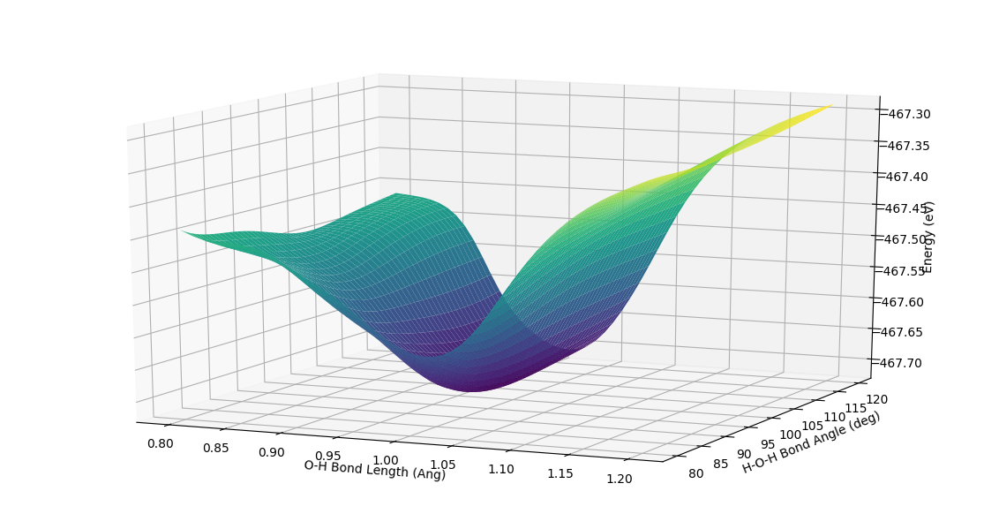

# 'Uniformly accurate interatomic potentials for materials simulations [Phys. Rev. Mater. 3, 023804 (2019)]' results reproduction

## Problem Description

The paper proposed an active learning procedure called deep potential generator (DP-GEN) for the construction of both accurate and efficient machine learning-based model for the potential energy surface (PES) for materials. The proposed procedure consists of three main components: exploration, generation of accurate reference data, and training. The authors applied this procedure to the sample systems of Al, Mg, and Al-Mg alloys and proved that DP-GEN can produce uniformly accurate PES models with a minimal number of reference data. We would like to reproduce the result from this paper with similar and get a insight of the DP-GEN model/procedure.

## DeePMD-kit
### About DeePMD-kit
DeePMD-kit is a package written in Python/C++, designed to minimize the effort required to build deep learning based model of interatomic potential energy and force field and to perform molecular dynamics (MD). This brings new hopes to addressing the accuracy-versus-efficiency dilemma in molecular simulations. Applications of DeePMD-kit span from finite molecules to extended systems and from metallic systems to chemically bonded systems.

### DeePMD-kit Workflow
#### Prepare data
In order to initiate the training process, one needs to provide the following information to feed the model: the atom type, the simulation box, the atom coordinate, the atom force, system energy and virial. A snapshot of a system that contains these information is called a frame. Consequently, one needs to generate a great amount of frames with accurate information before training. The dataset can generated with ab initio molecular dynamics simulations.

#### Train a model
Provided the DP parameters, the DeePMD-kit will finish the training step automatically.

#### Freeze a model
The trained neural network is extracted from a checkpoint and dumped into a database. This process is called "freezing" a model. 

#### MD runs with the model
After freezing a model, the total energy, forces and virial can be predicted quickly by feeding the geometric information of the system to the model. DeePMD is interfaced with high-performance classical MD and quantum (path-integral) MD packages, i.e., LAMMPS and i-PI, respectively. The model can also be integrated into native MD code easily because of its highly modularized characteristic。
  

### Example: Water Molecule PES by DeePMD-kit
As a warm up, we applied DeepMD-kit to calculate PES of water molecule as function of O-H bond length and bond angle.
  
Here we show the PES of water molecule by DeepMD.

## Results reproduction steps
Since the paper doesn't provide a detailed step-by-step instructions for active learning, here we suggest a similar process as following:

### Prepare initial dataset
The initial small size dataset can be generated with MD and DFT. We are going to use MD method to generate a series of configurations (lattices and atomic positions) of the system and use DFT to obtain the accurate information, i.e. the atom force, system energy and virial of different configurations. 

### Train a bunch of models
We will train an ensemble of DP models using the same initial dataset but different initialization of the parameters. For each new configuration that is explored by DPMD, these models generate an ensemble of predictions.

### Explore new dataset
At this step, we will use MD method to generate a great amount of new configurations and explore them with our trained models. For each configuration, each model will provide a prediction. For each model, the model deviation is defined as the maximum standard deviation of the predicted atomic forces. A high model deviation indicates low quality in the model prediction and is proposed for labeling. 

### Label uncertain data
The data points with high model deviation are kept as a new dataset. The dataset is feed into the DFT calculations and labeled with accurate energies, forces and virials.

### Back to training
As we obtain the new accurate training dataset, we can go back to the training step. The ensemble of models are going to be trained with the 'poor performance' dataset. Hopefully with few training cycles the models would be converge to fairly accurate models.

## Expectation
We would like to reproduce similar result as provided in this paper. In the process, we want to get familiar with, in general, what the workflow is like for DeePMD-kit. We would also like to see how the active learning model perform here, i.e. by how much it increases the efficiency and how much accuracy can it achieve.

## Difficulties
Considering the long training time, we want to install DeePMD-kit on HPC. First of all we need to make tensorflow work. For the certeain version of tensorflow suggested by the DeePMD-kit, we spent quite an amount of time to find compatible versions of gcc and python. However, the tensorflow installed in the /.local folder can't be recognized by the installation code. We went to HPC office hour and found a way to cut corners, i.e., mannually set the path to tensorflow in their installation code. The problem now is that finally the installation code attempts to write into a folder which is protected. We are trying to find a solution for this.

## Reference  
[1] Linfeng Zhang, De-Ye Lin, Han Wang, Roberto Car, and Weinan E, Phys. Rev. Materials 3, 023804 – Published 25 February 2019

